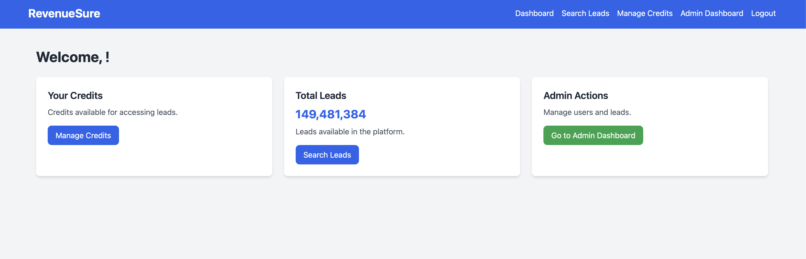

# RevenueSure
RevenueSure is a powerful tool designed to help businesses discover and manage leads across both B2B and B2C sectors. With a focus on accuracy and efficiency, this solution leverages advanced search algorithms to gather contact data, enabling users to easily find valuable prospects, streamline their lead generation process, and boost sales performance.

Key Features:

B2B & B2C Lead Discovery: Seamlessly find business and consumer contacts.
Contact Management: Organize and track leads with ease.
Data Accuracy: Ensure reliable and up-to-date contact information.
Scalable: Designed for small businesses and large enterprises alike.
Leverage RevenueSure to enhance your lead generation strategy and accelerate your revenue growth.

Config:

1) DB changes in db.php

2) Set Up Cronjob

Add the following cronjob to your server to run cron.php every hour:

Open the terminal and type:

crontab -e

Add this line to run the script every hour:

0 * * * * /usr/bin/php /path/to/your/project/cron.php

Features:

Changelog:

v1 : Jan 28th 2025

Core Functionality:
1. User Authentication:
    * User registration (register.php) with username, email, password, and role (user/admin).
    * User login (login.php).
    * User logout (logout.php).
    * Session-based user authentication and authorization.
2. Dashboard:
    * User-specific dashboard (dashboard.php) displaying:
        * Welcome message with the user's name.
        * User's credit balance.
        * Total leads count.
        * Admin-specific actions (if user is an admin).
        * To-do list with options to add and mark complete and filter
3. User Profile:
    * User profile management (profile.php)
        * Display user details, username, email and profile picture.
        * Ability to upload a profile picture
        * Ability to remove profile picture.
        * Ability to update profile info
        * Ability to update password
4. Leads Management:
    * Adding new leads (add_lead.php) with name, email, phone, category and assignee.
    * Searching leads (search_leads.php) by name, email, or phone, with filters for categories, status, date range and location(city, state, country).
    * Listing leads (leads_list.php) with pagination, sorting, and filtering based on multiple attributes such as name, email, phone, category, status, date range and location.
    * Viewing lead details (view_lead.php) including attachments, behavior tracking and conversion to a customer.
    * Tracking lead behavior (track_behavior.php) like website visits, email opens, and form submissions
* Ability to convert leads to customers.
* Add different types of attachments (file, contract, proposal, notes) to the lead and manage them
    * Editing leads (edit_lead.php).
    * Deleting leads (delete_lead.php).
    * Mass delete leads functionality mass_delete_leads.php
    * Exporting Leads to csv
    * User Specific lead list your_leads.php
5. Categories Management:
    * Managing lead categories (manage_categories.php).
    * Adding new lead categories (add_category.php).
    * Editing existing lead categories (edit_category.php).
    * Deleting lead categories (delete_category.php).
6. Employees Management:
    * Managing employees (manage_employees.php).
    * Adding new employees (add_employee.php).
    * Editing existing employees (edit_employee.php).
    * Deleting employees (delete_employee.php).
7. Credits Management:
    * Managing user credits (manage_credits.php).
    * Adding credits to user accounts.
8. Tasks Management:
    * Managing Tasks view_tasks.php
        * Adding new tasks add_task.php
        * Editing existing tasks edit_task.php
        * Deleting tasks delete_task.php
        * Toggle task status toggle_task_status.php
        * Set task reminders
9. Customer Management:
    * Managing customers (manage_customers.php).
    * Adding new customers (add_customer.php).
    * Viewing customer profiles (view_customer.php) with
* Ability to view, add and remove customer info, preferences and demographic data
* Add customer interactions and tags
    * Editing existing customers (edit_customer.php).
    * Deleting customers (delete_customer.php).
10. To-Do List:
 User can add new to-do tasks with title, description, and due date add_todo.php.
* User can mark to-do tasks as complete. mark_complete.php
    * User can edit existing to-dos edit_todo.php
* User can remove existing to-dos delete_todo.php
* User can add relation to task, lead or customer.
11. Notifications:
* Users receive notifications for task reminders.
* Users can view notifications view_notification.php
1. Reporting Dashboard:
    * Admin can access reporting dashboard reporting_dashboard.php
        * View lead conversion rate
        * View lead source analysis
        * View sales performance data
2. Billing and Invoicing
    * Create invoices add_invoice.php
        * Edit invoices edit_invoice.php
        * View invoices view_invoice.php
    * Manage invoices manage_invoices.php
    * Delete invoices delete_invoice.php
    * Add products and services to the invoice fetch_products_services.php
    * Auto-calculate subtotals, taxes and totals.
Helper Functionality:
* Action Logging:
    * Basic action logging using log_action.php and logs.txt
* Attachment Deletion delete_atttachment.php
* Search Employees: Dynamic search of employees search_employees.php
* Related Entity Search: Dynamic search for tasks, leads and customers when adding a todo item fetch_related_entities.php
* Reminder Setting: Ability to set task reminder. add_reminder.php
* Upload Profile Picture: Allows user to upload their own profile picture upload_profile_picture.php
